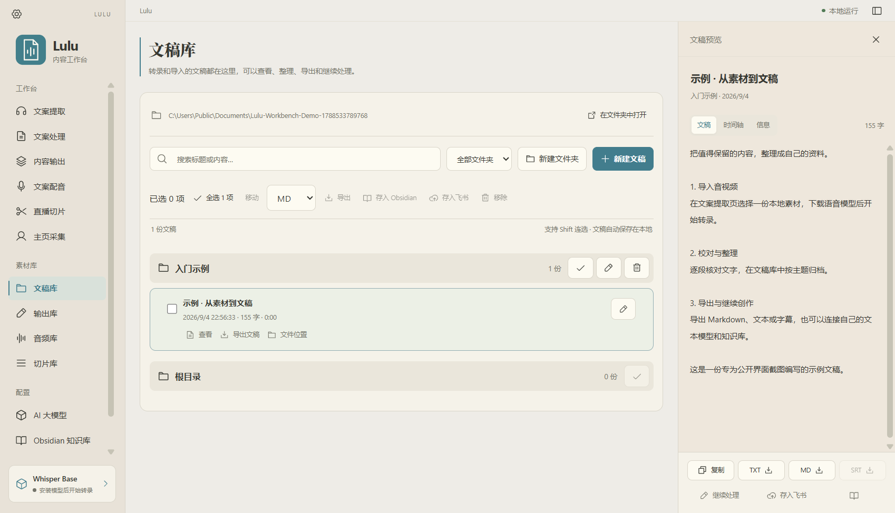

# Lulu Workbench

面向 Windows 的本地内容工作台：把音视频转换为文稿，整理素材，再进行文案处理、系统配音、切片与知识库导出。

这是参考 [Lulu for macOS](https://github.com/AidenXu-1/Lulu) 的公开工作流程独立实现的开发预览版，并非官方 Windows 发行版。当前分享的是源码项目，尚无双击即装的独立安装包。界面采用本项目独立绘制的图标。

> 使用前请查看 [已知问题](docs/KNOWN_ISSUES.md)。本地核心流程已验证；飞书真实账号写入、部分平台采集与字幕仍需验证，不承诺全部功能或全部链接可用。

## 界面预览



## 在 Windows 上安装

支持 Windows 10 / 11，当前验证环境为 x64。第一次安装需要联网下载依赖和语音模型。建议将源码解压到普通用户有写入权限的文件夹，例如 `D:\Apps\LuluWorkbench`。

1. 从本仓库页面点击 **Code → Download ZIP**，解压到一个固定目录；也可以用 Git 克隆。
2. 安装以下依赖，并重新打开终端，让 PATH 生效：
   - [Node.js](https://nodejs.org/en/download)：22.12 或更新版本，包含 npm。
   - [uv](https://docs.astral.sh/uv/getting-started/installation/)：用于自动准备 Python 3.12 和 Python 依赖。
   - [FFmpeg](https://ffmpeg.org/download.html)：Windows 版本，确保终端可运行 `ffmpeg -version` 与 `ffprobe -version`。
3. 在项目文件夹打开 PowerShell，运行：

```powershell
powershell.exe -NoProfile -ExecutionPolicy Bypass -File .\setup.ps1
```

此命令仅为本次安装脚本设置执行策略，不修改系统的全局执行策略。脚本会检查依赖、创建项目内 Python 环境、安装锁定依赖并构建界面。重复运行会复用已有 Python 环境，不删除用户资料库。

4. 安装完成后，双击 **start.vbs**。也可以在项目目录运行 `npm.cmd start`。
5. 首次打开进入 **AI 大模型 → 本地语音转录**，下载 **Whisper Base**。模型下载完成后，即可导入音视频并点击任务的“开始”。

需要创建桌面快捷方式时，右键 `start.vbs`，选择“发送到 → 桌面快捷方式”。启动依赖项目目录，请保留 `.venv`、`node_modules`、`dist` 和 `backend`；不要只复制 `start.vbs` 到另一台电脑。

## 能做什么

- 导入本地音视频、TXT、Markdown 和 SRT；支持拖放和录音入口。
- faster-whisper 本地 CPU / INT8 转录、任务队列、进度、暂停和失败重试。
- 文稿正文与逐段时间轴编辑；全文按原顺序保留每行一句时，校稿保留已有字幕时间戳。
- 播放时当前字幕高亮并置顶，手动浏览或编辑时暂停跟随；支持回到当前句、单句循环与播放倍速。
- 文稿、文案处理及配音草稿恢复；文稿历史版本预览和恢复、回收站单项及批量恢复。
- 文件夹管理、搜索、Shift 连选、批量移动和导出；素材库批量操作仅包含当前可见的选中项。
- TXT、Markdown、SRT、CSV、ZIP 导出与 Obsidian Markdown 导出。
- 抖音独立登录窗口与主页作品采集；其他公开链接通过 yt-dlp 处理。
- 独立下载封面、音视频，优先使用可获取的字幕，选择保留目录和定位本地文件。
- 接入 Agnes AI、DeepSeek 等 OpenAI Chat Completions 兼容文本服务，进行摘要、校正、改写、大纲和翻译；提供快捷配置与独立连接测试。
- Jev 创作检查：逐段检查表达、对照原稿、高亮定位；用当前文本模型生成建议，逐项采纳并保留历史版本与字幕时间戳。
- 使用 Windows 系统语音生成 WAV 配音；每份来源文稿分别保存配音正文、音色和语速，生成结果记录来源及制作参数。
- 按起止时间截取本地音视频，配音与视频素材可直接定位到媒体文件。
- 飞书 OAuth、知识库位置预设、新建或已有多维表格、字段及附件导出和失败重试。
- 中文界面、浅色与深色外观。

音色克隆、生成前的短句试听、双语时间轴字幕翻译、按字幕选句切片、一键资料库备份、实时直播录制、自动精彩片段识别、自动更新和独立安装器尚未实现。“直播切片”页面目前处理的是已导入的本地录播文件；文案处理中英翻译生成的是独立文本，不会自动产生双语 SRT。

## 常用操作

1. **转录**：文案提取 → 导入文件或粘贴链接 → 开始 → 查看右侧文稿。
2. **边听边校对**：当前字幕默认显示在文稿区第一行。手动滚动或进入编辑后会暂停跟随，点击“回到当前句”恢复；可用“单句循环”和播放速度反复听辨。高亮用于定位，不会自动纠正识别文字。
3. **保存字幕或口播稿**：在“时间轴”逐句修改，或通过“编辑全文”按原顺序保留一行一句后保存，可保留原时间戳。增删句子导致行数改变时，直接保存会被阻止；点击“另存口播稿”生成独立文稿，原字幕不变。此功能不重新分析语音或自动重新对齐大幅改写的文字。
4. **恢复内容**：右侧“历史版本”可预览并恢复编辑或重转前的文稿；恢复前的当前版本也会保留。移除的素材可在左侧“回收站”恢复。任务正在处理时，需先暂停并等待停止，再恢复历史版本。
5. **整理与导出**：在文稿库按文件夹、多选或搜索整理，再导出文件或存入 Obsidian。批量操作只针对当前可见的选中项；折叠组内的隐藏项不会被一并操作，切换搜索条件或文件夹会清空选择。
6. **文本模型**：在“AI 大模型 → 文本处理模型”选择 Agnes AI、DeepSeek 或自定义兼容服务，填写对应 API Key，再点击“测试连接”和“保存配置”。测试会向当前表单指定的服务发送固定短句，不保存设置或读取文稿；保存配置本身不代表连通。各服务的密钥按 API 地址分别加密保存，切换服务不会把上一家的密钥发送给另一家。本项目不附送模型服务或 API 额度。
7. **配音**：选择已保存文稿或手动输入正文，再选系统声音和语速。页面会分别保存各来源的配音草稿，等待“草稿已保存”后即可切页或重启；生成后在音频库播放 WAV。音色取决于 Windows 已安装的语音包，尚无生成前短句试听按钮。
8. **飞书**：填写自己的应用信息，按页面配置权限和三个回调地址，再登录授权并设置导出位置。真实写入需要对应账号有访问权限。

链接采集取决于平台的正常登录状态、网络和内容权限。请在程序自己的窗口中完成平台要求的登录或验证。转录结果中的同音字、人名和专有名词仍需校对。

### 使用 Agnes AI

1. 在 [Agnes 密钥管理页面](https://platform.agnes-ai.com/settings/apiKeys) 创建自己的 API Key。
2. 打开 Lulu 的“AI 大模型 → 文本处理模型”，服务商选择 **Agnes AI**。
3. 程序自动填写 `https://apihub.agnes-ai.com/v1` 和 `agnes-3.0-flash`；也可以选择 `agnes-2.5-flash` 或填写账号可用的模型名称。
4. 将密钥粘贴到密码输入框，点击“测试连接”。通过后保存配置，即可用于文案摘要、校正、改写、大纲和翻译。

接入方式依据 [Agnes 3.0 官方文档](https://agnes-ai.com/en/docs/agnes-30-flash)。密钥管理网页不是推理接口；程序会修正误填的 Agnes 控制台地址。测试连接需要有效密钥和对应模型权限，可能计入服务额度；模型列表可访问不等于密钥已验证。此处接入的是文本处理，未接入 Agnes 的图片或视频生成功能。

### 使用 Jev 创作检查

1. 打开 **AI 大模型 → Jev 内容检查**，填写自己的 TypeSafe API Key，验证连接并保存。此密钥独立于 Agnes、DeepSeek 等文本服务。
2. 打开文稿右侧的 **检查** 页。新生成的文案会保留处理时的原文快照；旧文稿可手动选择对照原稿。不选择原稿时只检查表达。
3. 点击 **一键检查**，查看高亮的问题段落和原稿对照。“定位正文”可跳转到正文或对应字幕位置。
4. 点击 **生成修正建议**，由当前配置的文本模型（如 Agnes）生成候选文本。核对后点 **采纳这一处**，原稿自动进入历史版本，已有字幕时间戳保留。
5. 修改后检查结果会标为过期，点击 **重新检查**。低置信度或信息不足的结论标为“待人工核对”，不会自动生成修正。

依据 [TypeSafe HTTP API](https://docs.typesafe.ai/api) 接入，默认固定模型 `jev-1.13.0`。单次支持正文与原稿合计 22 KB（UTF-8）、最多 80 个非空段落，超限会明确提示拆分，不会静默截断。检查时将正文和对照原稿发送至 TypeSafe，生成建议时发送至所配置的文本服务。检查不验证外部事实真伪、音画同步或传播效果；模型判断仍需人工核对。真实连接需要用户自己的有效密钥与额度，离线测试不能代替真实服务验收。

## 数据存储与备份

- `data/library.sqlite3`：文稿、任务、历史版本、回收站记录、草稿与设置。
- `data/media/`：导入和下载的音视频。
- `data/models/`：语音模型。
- `data/outputs/`：生成的配音与切片。

尚无一键备份与整库恢复界面；请关闭程序后备份整个 `data` 文件夹。若设置了 `LULU_DATA_DIR`，请备份设置页显示的实际数据目录；另行选择的媒体保存目录也应单独备份。回收站用于恢复移除的列表记录，历史版本用于恢复文稿和字幕，均不能代替完整文件备份。移除列表记录不会自动删除源文件，回收站没有永久删除按钮。关闭主窗口会结束此次启动的本地服务，未完成任务下次打开可重新开始，已下载媒体可复用。

App Secret 与模型 API Key 使用 Windows DPAPI 加密，迁移到其他 Windows 用户或电脑后需要重新配置。平台 Cookie 和独立登录窗口的会话用于用户主动发起的采集；程序不会读取现有 Chrome/Edge 账号配置。

本地转录在本机完成；模型下载和内容采集会连接对应服务。使用文本模型会把所选正文发给配置的服务，飞书导出会把用户选择的资料发送至飞书。

本仓库不包含用户数据库、音视频、账号密钥、Cookie、模型权重、参考录屏或本地验收截图。

## 开发与验证

完成安装后：

```powershell
npm.cmd run build
npm.cmd start
```

浏览器开发需要两个终端，分别运行：

```powershell
.\.venv\Scripts\python.exe -m backend.main
npm.cmd run dev
```

浏览器后端默认为 `127.0.0.1:18793`；桌面程序选择空闲回环端口。可使用 `LULU_DATA_DIR` 指定独立资料库目录。

可重复的后端回归测试：

```powershell
.\.venv\Scripts\python.exe -m pytest tests/test_backend.py tests/test_parity.py tests/test_acceptance.py tests/test_creator_safety.py tests/test_llm_providers.py tests/test_review.py -q
```

`tests/test_creator_safety.py` 覆盖字幕时间戳保护、历史版本、恢复与回收站，以及配音来源和制作参数等内容保护行为。这些测试使用独立临时资料库，云端交互使用测试响应，不能代表真实账号写入或每个平台都已验证。

`tests/test_llm_providers.py` 使用模拟 HTTP 响应验证 Agnes 地址规范化、服务密钥隔离和连接测试；不使用个人 API Key，不代表账号认证或服务额度已经验收。

`tests/test_review.py` 验证 Jev 响应校验、原稿快照、低置信度处理、过期建议拦截和版本及时间戳保护。构建后运行 `node tests/review-workflow.mjs` 可在独立资料库验证检查、高亮定位、建议采纳与重新检查；模型使用离线测试响应，不消耗账号额度。

可重复的创作者工作流界面验证：

```powershell
npm.cmd run build
node tests/creator-workflow.mjs
```

需要项目 Python 环境、FFmpeg、npm 依赖及 Windows 上的 Microsoft Edge。脚本会生成测试视频，在 `.test-data/creator-workflow-*` 新建隔离资料库并启动独立后端，不使用个人资料库或外部模型服务。它在真实浏览器中检查 7 条流程：字幕置顶与手动暂停跟随、单句循环与倍速、全屏进出、全文校稿保留时间戳及 SRT、历史版本恢复、结构改写另存口播稿、回收站批量恢复。结果 JSON 和截图保存在该测试目录；脚本结束会停止测试后端。

截至 2026-09-19，上述 7 条界面流程已通过；配音草稿跨页恢复及素材库选择范围另做了隔离界面验证，不包含在这 7 条脚本检查内。测试视频配用合成音频和预置字幕，这份脚本不验证真实语音识别准确率。私人素材验收脚本及原始报告未纳入公开仓库；其他限制见 [docs/KNOWN_ISSUES.md](docs/KNOWN_ISSUES.md)。

## 来源与许可

交互流程参考 Lulu 的公开介绍与操作演示，Windows 程序独立实现。第三方依赖及图标来源见 [THIRD_PARTY_NOTICES.md](THIRD_PARTY_NOTICES.md)。本仓库暂未指定代码的开源许可证，各依赖继续遵循其自身许可。
